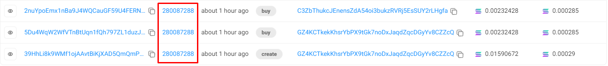

# **PumpFun Bundler**  

**An efficient self-bundling script for creating and buying tokens with 20 different wallets in one single bundle on the PumpFun protocol.**  

The **PumpFun Bundler** is a fast, efficient tool for creating tokens and buying them using up to **20 different wallets** in one bundled transaction. This script simplifies the process of managing multiple wallets and tokens while ensuring a smooth and seamless token creation and purchase experience on the **PumpFun platform**.


[](https://x.com/toptrendev)
[](https://discord.com/users/648385188774019072)
[](https://t.me/toptrendev_146)

---

## **📌 Overview**  

The **PumpFun Bundler** allows you to create tokens and buy them across multiple wallets using a single bundled transaction. It's designed to be the **best, fastest**, and **most efficient** way to launch tokens on the **PumpFun site**.

---

## **⚙️ Installation**

To install the PumpFun Bundler SDK, run the following npm command:

```bash
npm i pumpdotfun-sdk
```

---

## **🛠️ Usage Example**

### Step 1: Set up your environment

1. Create a `.env` file and add your RPC URL (refer to `.env.example` for the format).

2. Fund an account with at least **0.004 SOL** (which will be generated when you run the command below).

### Step 2: Edit Token Metadata

You can customize the metadata for your token as desired. Here's an example:

```typescript
const metadata = {
  name: "SolTrendingToken",
  symbol: "STT",
  description: "Solana Trending Token",
  image: "./upload/img.jpg",
  showName: true,
  createdOn: "https://pump.fun",
  twitter: "https://x.com/soltrendev",
  telegram: "https://t.me/soltrendev",
  website: "https://soltrendev"
}
```

### Step 3: Run the Token Launch

Run the following command to launch your token and perform bundling:

```bash
npx ts-node example/basic/index.ts
```

You can check your token launch and bundling:

- **PumpFun Site**: [View Token Launch](https://pump.fun/2q4JLenwD1cRhzSLu3uPMQPw4fTEYp7bLtfmBwFLb48v)
- **Solscan**: 

---

## **💻 PumpDotFunSDK Class**  

The `PumpDotFunSDK` class provides methods to interact with the **PumpFun** protocol. Below are the method signatures and their descriptions.

### **`createAndBuy` Method**  

```typescript
async createAndBuy(
  creator: Keypair,
  mint: Keypair,
  createTokenMetadata: CreateTokenMetadata,
  buyAmountSol: bigint,
  slippageBasisPoints: bigint = 500n,
  priorityFees?: PriorityFee,
  commitment: Commitment = DEFAULT_COMMITMENT,
  finality: Finality = DEFAULT_FINALITY
): Promise<TransactionResult>
```

- **Creates a new token and buys it.**
- **Parameters**:
  - `creator`: The keypair of the token creator.
  - `mint`: The keypair of the mint account.
  - `createTokenMetadata`: Metadata for the token.
  - `buyAmountSol`: Amount of SOL to buy.
  - `slippageBasisPoints`: Slippage in basis points (default: 500).
  - `priorityFees`: Optional priority fees.
  - `commitment`: Commitment level (default: `DEFAULT_COMMITMENT`).
  - `finality`: Finality level (default: `DEFAULT_FINALITY`).
- **Returns**: A promise that resolves to a `TransactionResult`.

---

## **🚀 Running the Examples**

### **Basic Example**

To run the basic example for creating, buying, and selling tokens, use:

```bash
npx ts-node example/basic/index.ts
```

---

## **💡 Contributing**

We welcome contributions to this project! If you have any ideas, improvements, or fixes, please feel free to submit a **Pull Request** or open an **Issue**.

---

## **🔥 PumpFun Bundler V2**

### **Introducing PumpFun Bundler Version 2**

Now you can create and buy tokens with **20 wallets in a single bundle**. This new version further improves efficiency and simplifies the process for users managing multiple wallets.

- **Example**:  
  [View Example Transaction](https://explorer.jito.wtf/bundle/28d842bef7c919cee00798cee05bb15616bdf96574a8428a27b81c71252342e0)
